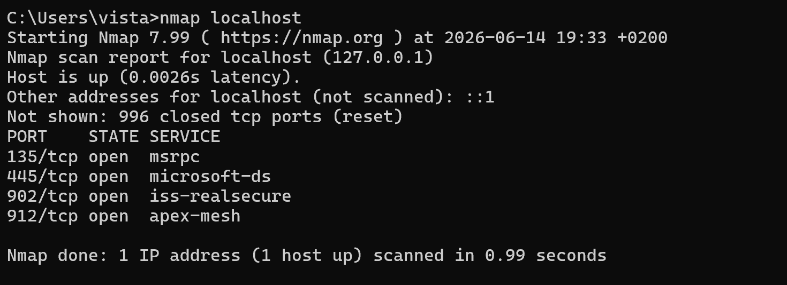
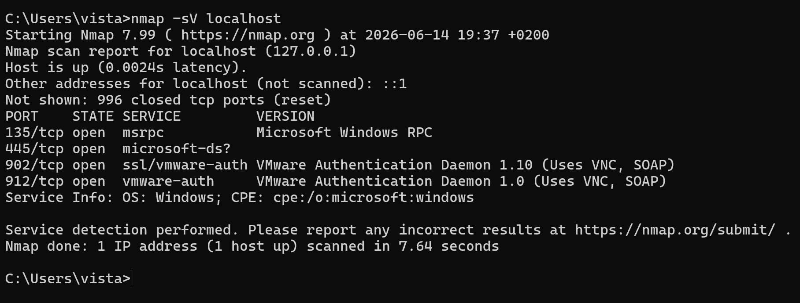
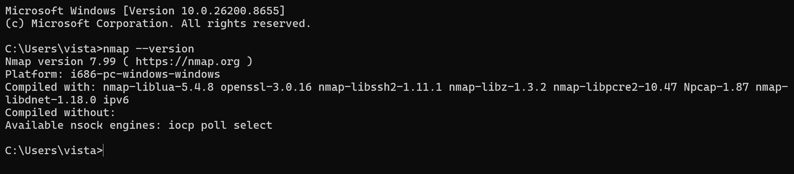

# Nmap Scanning Lab

## Objective

This lab demonstrates basic network scanning using Nmap in a safe local environment.

## Tools Used

* Windows Command Prompt
* Nmap 7.99
* GitHub for documentation

## Target

The scan target used in this lab is:

```text
localhost
```

This means the scans were performed against my own machine.

## Scan 1: Basic Nmap Scan

### Command Used

```cmd
nmap localhost
```

### Purpose

This scan checks the most common ports on the local machine and identifies whether any ports are open, closed, or filtered.

### Screenshot



## Scan 2: Service Version Detection

### Command Used

```cmd
nmap -sV localhost
```

### Purpose

The `-sV` option attempts to detect the service and version running on open ports.

### Screenshot



## Nmap Version

The installed Nmap version was verified using:

```cmd
nmap --version
```

### Screenshot



## Findings

The basic Nmap scan against `localhost` showed that the host was up and responding.

The scan identified several open TCP ports on the local machine:

- `135/tcp` - msrpc
- `445/tcp` - microsoft-ds
- `902/tcp` - iss-realsecure
- `912/tcp` - apex-mesh

## Analysis

Port `135/tcp` and `445/tcp` are commonly associated with Windows networking services. Since this scan was performed against my own Windows machine, these results are expected.

This lab helped me understand how Nmap can be used to identify open ports and exposed services on a target system. In a real security environment, open ports should be reviewed to confirm whether they are required and properly secured.

## What I Learned

* How to verify Nmap installation
* How to scan a local machine safely
* How to identify open ports
* How service detection works using `-sV`
* Why documentation is important in cybersecurity work

## Notes

This lab was performed only on my own system for learning and documentation purposes.
