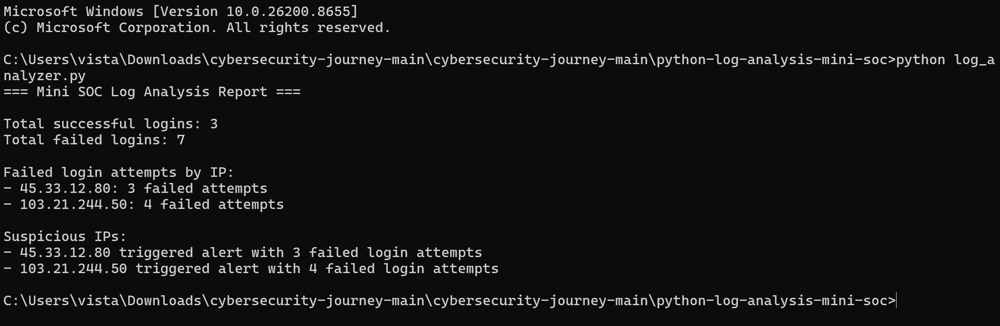

# Python Log Analysis Mini SOC

## Objective

This project simulates a basic SOC analyst task by analyzing log entries and identifying suspicious activity.

## Tools Used

- Python 3.12.1
- Windows Command Prompt
- GitHub

## What the Script Detects

- Failed login attempts
- Successful logins
- Suspicious IP addresses
- Repeated failed login activity

## Project Files

- `log_analyzer.py` - Python script used to analyze logs
- `sample_logs.txt` - Sample log data
- `findings.md` - Summary of analysis results

## Skills Demonstrated

- Python scripting
- Log analysis
- Basic SOC investigation
- Security reporting
- GitHub documentation

## Status

## Script Output

