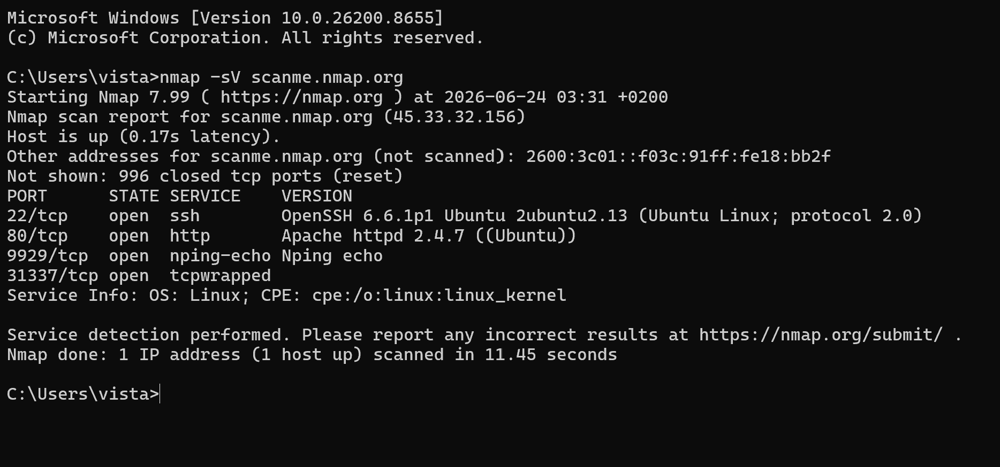

# Authorized Web-Service Enumeration Lab

## Objective

This lab demonstrates basic web-service and network-service enumeration using Nmap against an authorized public practice target.

## Authorization and Scope

The target used in this lab was:

```text
scanme.nmap.org
```

This host is provided by the Nmap Project for testing Nmap scans. The activity in this project was limited to basic service and version detection. No exploitation, password attacks, denial-of-service activity, or intrusive testing was performed.

## Tools Used

* Nmap 7.99
* Windows PowerShell
* GitHub

## Target

* Hostname: `scanme.nmap.org`
* Resolved IPv4 address: `45.33.32.156`

## Command Used

```powershell
nmap -sV scanme.nmap.org
```

## Purpose of the Scan

The `-sV` option performs service and version detection on discovered open ports. This helps an analyst identify exposed services and understand the visible attack surface of a host.

## Scan Results

| Port        | State | Service    | Detected Version / Detail                        |
| ----------- | ----- | ---------- | ------------------------------------------------ |
| `22/tcp`    | Open  | SSH        | OpenSSH 6.6.1p1 Ubuntu 2ubuntu2.13               |
| `80/tcp`    | Open  | HTTP       | Apache httpd 2.4.7 (Ubuntu)                      |
| `9929/tcp`  | Open  | Nping Echo | Nping echo service                               |
| `31337/tcp` | Open  | tcpwrapped | Service identification restricted or unavailable |

## Additional Observations

* The target host was reachable with approximately `0.17s` latency.
* Nmap reported `996` scanned TCP ports as closed.
* Service detection indicated a Linux operating system.

## Analysis

The scan identified several services exposed to the network. SSH on port `22` allows remote administration and should generally be protected with strong authentication, limited access, and secure configuration. HTTP on port `80` exposes a web service that should be patched, monitored, and reviewed for unnecessary information disclosure.

The result `tcpwrapped` on port `31337` does not prove a vulnerability. It indicates that Nmap could not fully identify the service, potentially because access was restricted or the connection was closed before service detection could complete.

## What I Learned

* How to perform basic service and version detection with Nmap
* How open ports contribute to an exposed attack surface
* How to distinguish observation from proof of a security vulnerability
* How to document an authorized enumeration activity responsibly

## Evidence


